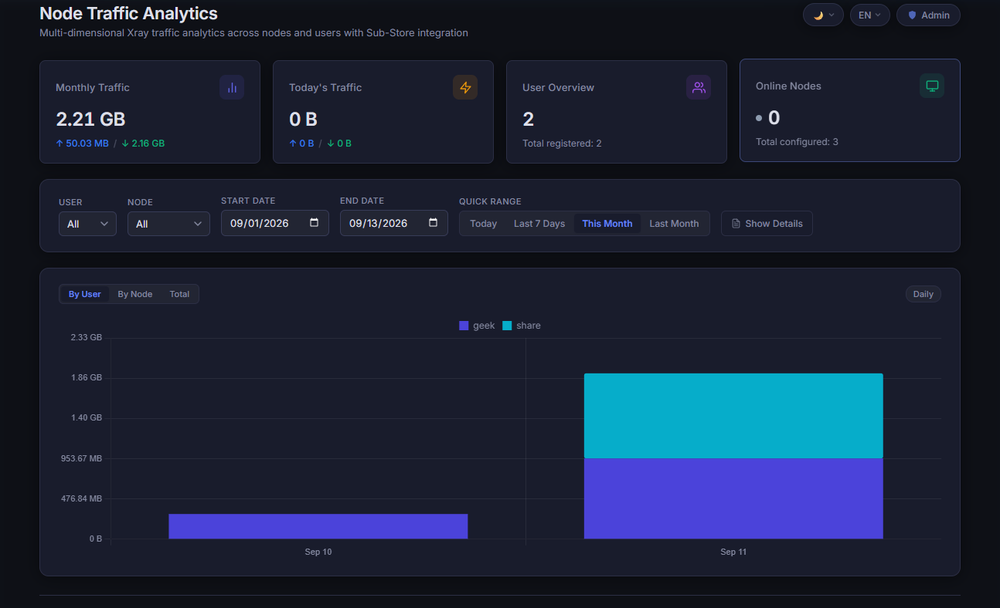

# xflow

[English](README.md) | [简体中文](README_zh-CN.md)

A lightweight, self-hosted traffic aggregation and statistics server for Xray proxy nodes.

`xflow` collects periodic traffic usage reports sent by [xflow-agent](./agent) instances running on your nodes, records usage deltas in a high-performance SQLite database, provides an interactive web dashboard, and exposes a Sub-Store compatible subscription header endpoint (`/flow`).

<p align="center">
  
</p>

---

## Features

- **Sub-Store Traffic Info Integration (`/flow`)**: Serves the standard `subscription-userinfo` header (`upload=...; download=...; total=...; expire=...`) along with client profile headers (`profile-update-interval`, `profile-web-page-url`) and JSON payload for Sub-Store and proxy client subscription widgets.
- **Multi-Node Traffic Collector (`/report`)**: Receives traffic reports securely via Bearer token authentication with clear console logs in MB units.
- **Modern Web Dashboard (`/dashboard`)**:
  - Interactive multi-view charts: **By User**, **By Node**, and **Total Uplink/Downlink**.
  - **Dynamic Granularity & Drill-Down**: Hourly resolution for ranges up to 3 days, daily otherwise. Click any daily column to drill down into that day's 24-hour hourly view, with a dedicated return button.
  - **Advanced Pagination Toolbar**: Paginated detailed traffic records with continuous row indices (`#`), total count, page size switcher (10, 15, 20, 50), page jumping, and stable table heights.
  - **Accurate Local Timezone Support**: Local date range query filtering (`00:00:00` to `23:59:59`), calendar date initialization, and timezone-aware chart bucketing via client `tz` offset.
  - **Fully Responsive & Themed**: Adaptive 2-column mobile filters, horizontal table scrolling, auto-consolidated mobile chart ticks, and Dark/Light theme toggle with multi-language support (English / Chinese, default: Auto).
- **Automated Database Compaction & Retention**:
  - Automatically cleans records older than `RETENTION_DAYS` (default: 90 days).
  - Automatically compacts raw reports older than `AGGREGATION_DAYS` (default: 3 days) into 1-hour summaries grouped by user and node every day at 02:00 AM (local container timezone), minimizing database size while preserving full historical accuracy.
- **Node & Token Management (`/admin`)**:
  - Web UI and REST API to create nodes, rotate authentication tokens, and manage node lifecycles.
- **Fast & Minimal**: Powered by Node.js, Express, and SQLite with WAL (Write-Ahead Logging) enabled.

---

## Architecture

```
[ Xray Node 1 ] ──(gRPC StatsService)──> [ xflow-agent ] ──(HTTP POST /report)──┐
                                                                                 ▼
[ Xray Node 2 ] ──(gRPC StatsService)──> [ xflow-agent ] ──(HTTP POST /report)───> [ xflow Server ]
                                                                                   ├── SQLite (WAL)
                                                                                   ├── Web Dashboard
                                                                                   ├── Admin UI
                                                                                   └── /flow (Sub-Store)
```

---

## Quick Start

### Option 1: One-Click Installation Script (Linux)

For Linux servers (Ubuntu, Debian, CentOS, AlmaLinux, etc.):

```bash
# Run installer (automatically configures Docker, asks for port & quota, and starts xflow)
sudo bash <(curl -fsSL https://raw.githubusercontent.com/geekotaku/xflow/main/install.sh)
```

Or from a cloned repository:

```bash
sudo bash install.sh
```

---

### Option 2: Docker Compose (Manual)

1. Create a `docker-compose.yml` file:

```yaml
services:
  xflow:
    image: ghcr.io/geekotaku/xflow:latest
    container_name: xflow
    restart: unless-stopped
    ports:
      - "3000:3000"
    environment:
      PORT: "3000"
      DB_PATH: /data/xflow.db
      # ADMIN_PASSWORD: ""                   # optional, sets or resets admin password (can be commented out after setup)
      # ADMIN_USERNAME: "admin"              # optional, admin username (defaults to admin)
      # TZ: "Asia/Shanghai"                   # optional, container timezone for daily maintenance tasks
      # FLOW_DEFAULT_TOTAL: "1099511627776"  # optional, default quota in bytes (1 TB)
      # RETENTION_DAYS: "90"                  # optional, purge records older than N days (0 to disable)
      # AGGREGATION_DAYS: "3"                 # optional, compact records older than N days into 1h summaries
      # PROFILE_UPDATE_INTERVAL: "24"         # optional, client subscription auto-update interval (hours)
      # PROFILE_WEB_PAGE_URL: ""             # optional, web dashboard url for proxy client profile
    volumes:
      - xflow-data:/data

volumes:
  xflow-data:
```

2. Start the service:

```bash
docker compose up -d
```

### Option 3: Running from Source

**Requirements**: Node.js >= 22

```bash
# Clone the repository
git clone https://github.com/geekotaku/xflow.git
cd xflow

# Install dependencies
npm install

# Build TypeScript
npm run build

# Start the server
npm start
```

The server will start on `http://localhost:3000`.

---

## Sub-Store Integration (`/flow`)

Use this endpoint to provide traffic usage directly to Sub-Store:

```http
GET /flow?user=me@nodeA&start=2026-09-01&end=2026-09-10
```

### Query Parameters

| Parameter | Type   | Required | Description                                                                                                 |
| --------- | ------ | -------- | ----------------------------------------------------------------------------------------------------------- |
| `user`    | string | Optional | Comma-separated list of user identifiers/emails (e.g. `user=alice,bob`). If omitted, aggregates all users.  |
| `start`   | string | Optional | ISO date or timestamp (e.g. `2026-09-01`). Defaults to the 1st day of the current UTC month at `00:00:00Z`. |
| `end`     | string | Optional | ISO date or timestamp. Defaults to the current moment.                                                      |

### Response Headers

The response sets standard subscription headers used by Sub-Store and modern proxy clients:

```http
subscription-userinfo: upload=123456789; download=987654321; total=1099511627776; expire=1788220800
profile-update-interval: 24
profile-web-page-url: https://xflow.example.com
```

- **`total`**: Defaults to `1 TB` (`1099511627776` bytes) so clients never display a "quota exceeded" warning. Override via `FLOW_DEFAULT_TOTAL` (in bytes).
- **`expire`**: Dynamic expiration timestamp automatically aligned to the 1st of the next UTC month (`00:00:00Z`). Override via `FLOW_DEFAULT_EXPIRE` (Unix seconds).
- **`profile-update-interval`**: Tells proxy clients how often to automatically update subscription in hours (default: `24`, configurable via `PROFILE_UPDATE_INTERVAL`). _Note: Sub-Store does not forward upstream headers from Traffic Info URLs; configure a Modify Response action in Sub-Store (see details below)._
- **`profile-web-page-url`**: Injects your web dashboard link directly into client widgets for one-click access (configurable via `PROFILE_WEB_PAGE_URL`).

### Response Body

```json
{
  "user": "me@nodeA",
  "range": {
    "start": "2026-09-01T00:00:00.000Z",
    "end": "2026-09-10T05:54:00.000Z"
  },
  "upload": 123456789,
  "download": 987654321,
  "total": 1099511627776,
  "expire": 1788220800
}
```

### Sub-Store Configuration Example

In Sub-Store:

1. Open your combined or node subscription settings.
2. Under **Traffic Info** → **URL**, paste:
   ```text
   https://xflow.example.com/flow?user=your_email@domain.com
   ```
3. Save. Sub-Store will fetch usage and display remaining traffic in subscription clients (Clash, Surge, Shadowrocket, Quantumult X, etc.).

> [!TIP]
> **Injecting `profile-update-interval` in Sub-Store**:
> When configuring `/flow` under Sub-Store's **Traffic Info**, Sub-Store natively parses both `subscription-userinfo` (traffic & expiration) and `profile-web-page-url`, but does **not** forward upstream `profile-update-interval` into its final generated subscription.
>
> To pass `profile-update-interval` to proxy clients (Clash Verge Rev, Mihomo Party, Surge, Loon, etc.), configure a **Modify Response** action in Sub-Store:
>
> 1. In your Sub-Store subscription, switch to the **Actions** tab.
> 2. Add an action under **File Actions** → **Modify Response**.
> 3. Choose **Local Content** (JavaScript) and input:
>    ```javascript
>    $res.header["profile-update-interval"] = 24;
>    ```
> 4. Enable the action and save. Sub-Store will now inject this header into your subscription responses.

---

## Reporting API (`POST /report`)

Called periodically by [xflow-agent](./agent) on each proxy node.

### Request

```http
POST /report HTTP/1.1
Host: xflow.example.com
Authorization: Bearer <node_token>
Content-Type: application/json

{
  "node": "hk-node-01",
  "timestamp": "2026-09-10T05:54:00.000Z",
  "users": [
    { "user": "alice", "uplink": 10485760, "downlink": 104857600 },
    { "user": "bob",   "uplink": 5242880,  "downlink": 20971520 }
  ]
}
```

- **Authentication**: Requires a Bearer token created via the `/admin` panel.
- **Server Logging**:
  - Valid reports log an `[INFO]` message with traffic formatted in **MB**.
  - Missing or invalid tokens log an `[ERROR]` message to console.

---

## Admin Panel & Node Management (`/admin`)

Visit `http://localhost:3000/admin` in your browser to manage node tokens:

- **Initial Setup Wizard**: On your first visit, a setup wizard guides you to create the initial administrator username and password.
- **Password Protection & Session Auth**: All node management endpoints (`/api/admin/nodes*`) and admin operations are securely protected with HttpOnly session cookies.
- **Node & Token Operations**: Create nodes, copy tokens with one click, rotate credentials, or delete nodes.
- **Profile & Password Management**: Click "Change Password" in the admin header to modify your username or password anytime.
- **Emergency Password Reset**: If you forget your password, simply add or uncomment `ADMIN_PASSWORD: "new_password"` in `docker-compose.yml` and run `docker compose up -d`. The password will automatically reset on restart.

---

## Web Dashboard (`/dashboard`)

Visit `http://localhost:3000/` or `http://localhost:3000/dashboard/` to view traffic analytics:

- **Dimension Switcher**:
  - **By User**: Stacked bar chart showing each user's usage over time.
  - **By Node**: Stacked bar chart showing traffic distribution across nodes.
  - **Total**: High-level upload and download volume breakdown.
- **Daily-to-Hourly Drill-Down**: Click any daily bar to drill down into that day's 24-hour hourly distribution. Click "Back to Daily" to return.
- **Advanced Pagination Toolbar**: Continuous `#` sequence number, total count display, page size switcher (10, 15, 20, 50 / page), page jumping, and stable table heights.
- **Timezone**: Automatically localized to your browser's time zone for both query filtering and chart grouping.
- **Responsive & Themed**: 2-column mobile filters, horizontal table scroll, and Light/Dark theme switching.

---

## Environment Variables

| Variable                  | Default                | Description                                                                                                                                                             |
| ------------------------- | ---------------------- | ----------------------------------------------------------------------------------------------------------------------------------------------------------------------- |
| `PORT`                    | `3000`                 | HTTP port the server listens on                                                                                                                                         |
| `DB_PATH`                 | `data/xflow.db`        | Path to the SQLite database file                                                                                                                                        |
| `ADMIN_PASSWORD`          | `""`                   | Optional, automatically sets or overrides the admin password on startup (great for initial provisioning or emergency password reset)                                   |
| `ADMIN_USERNAME`          | `admin`                | Optional, admin username when paired with `ADMIN_PASSWORD`                                                                                                               |
| `FLOW_DEFAULT_TOTAL`      | `1099511627776` (1 TB) | Default total bytes reported in the `/flow` endpoint                                                                                                                    |
| `FLOW_DEFAULT_EXPIRE`     | `0` (dynamic)          | Custom expiration timestamp (Unix seconds) for `/flow`. When `0` or unset, dynamically sets to the 1st of the next UTC month                                            |
| `PROFILE_UPDATE_INTERVAL` | `24` (hours)           | Auto-update interval in hours for `/flow` headers. _(Note: When using Sub-Store, configure this directly within Sub-Store's subscription settings)_                     |
| `PROFILE_WEB_PAGE_URL`    | `""`                   | Dashboard URL injected into subscription client profile headers (`profile-web-page-url`)                                                                                |
| `RETENTION_DAYS`          | `90` (3 months)        | Number of days to retain traffic reports. Records older than this are automatically purged on startup and every 24h. Set to `0` to keep records indefinitely.           |
| `AGGREGATION_DAYS`        | `3` (days)             | Number of days after which raw reports are compacted into 1-hour summaries grouped by user and node every day at 02:00 AM. Set to `0` to keep raw records indefinitely. |
| `TZ`                      | `UTC`                  | Container timezone (e.g. `Asia/Shanghai`), determining the local time when daily scheduled maintenance tasks (02:00 AM) trigger.                                        |

---

## License

[MIT](./LICENSE)
