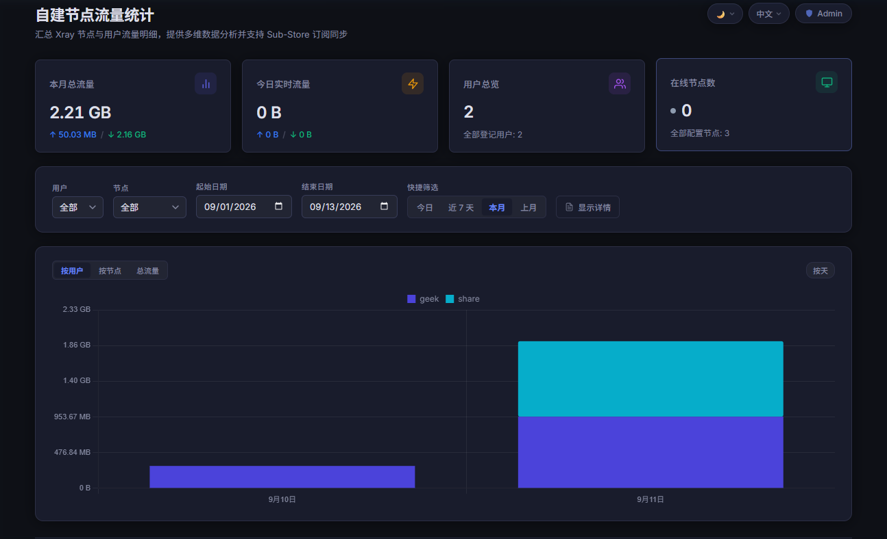

# xflow

[English](README.md) | [简体中文](README_zh-CN.md)

专为 Xray 代理节点设计的轻量级、自托管流量统计与汇聚系统。

`xflow` 负责收集各节点上运行的 [xflow-agent](./agent) 定期上报的流量使用情况，将增量数据记录到高性能 SQLite 数据库中，提供交互式 Web 仪表盘，并对外暴露兼容 Sub-Store 的订阅流量信息接口 (`/flow`)。

<p align="center">
  
</p>

---

## 功能特性

- **Sub-Store 流量信息集成 (`/flow`)**: 提供标准 `subscription-userinfo` 响应头 (`upload=...; download=...; total=...; expire=...`)、客户端配置头 (`profile-update-interval`、`profile-web-page-url`) 及 JSON 数据载荷，完美契合 Sub-Store 及各大代理客户端的订阅流量部件展示。
- **多节点流量收集器 (`/report`)**: 通过 Bearer Token 鉴权安全接收各节点流量上报，控制台输出清晰的 MB 格式日志。
- **现代化 Web 仪表盘 (`/dashboard`)**:
  - 交互式多维度图表：**按用户**、**按节点** 和 **总上行/下行** 统计。
  - **动态粒度与下钻功能**: 3 天以内查询自动按小时聚合，超过 3 天按天展示。点击任意柱状图可直接下钻查看该日期 24 小时的逐小时流量分布，并支持一键返回按天视图。
  - **专业分页工具栏**: 流量明细表格支持连续行序号 (`#`)、总条数统计、每页条数切换 (10, 15, 20, 50)、快捷跳页与固定表格高度（避免分页时页面跳动）。
  - **精准本地时区支持**: 本地日期范围查询过滤 (`00:00:00` 至 `23:59:59`)、日历自动初始化，并根据客户端 `tz` 时区偏移进行图表分桶展示。
  - **自适应响应式与主题切换**: 移动端适配 2 列筛选布局、表格横向滚动、移动端图表坐标轴标签智能稀疏化，支持深色/浅色主题切换与中英文多语言切换（默认跟随系统）。
- **数据库自动压缩与归档保留**:
  - 自动清理超出 `RETENTION_DAYS`（默认 90 天）的历史数据。
  - 每天凌晨 02:00（容器本地时间）自动将超出 `AGGREGATION_DAYS`（默认 3 天）的原始上报记录压缩为按用户和节点分组的 1 小时汇总数据，在保持历史统计完全精确的同时大幅缩减数据库体积。
- **节点与 Token 凭据管理 (`/admin`)**:
  - 提供 Web 管理界面与 REST API，支持节点创建、Token 复制与轮换，以及节点生命周期管理。
- **极速轻量**: 基于 Node.js、Express 和开启 WAL（预写式日志）的高性能 SQLite 构建。

---

## 系统架构

```
[ Xray 节点 1 ] ──(gRPC StatsService)──> [ xflow-agent ] ──(HTTP POST /report)──┐
                                                                                 ▼
[ Xray 节点 2 ] ──(gRPC StatsService)──> [ xflow-agent ] ──(HTTP POST /report)───> [ xflow 服务端 ]
                                                                                   ├── SQLite (WAL)
                                                                                   ├── Web 仪表盘
                                                                                   ├── 节点管理 UI
                                                                                   └── /flow (Sub-Store)
```

---

## 快速开始

### 方式 1：Linux 一键安装脚本

适用于主流 Linux 发行版（Ubuntu、Debian、CentOS、AlmaLinux 等）：

```bash
# 运行一键安装（自动检测安装 Docker 环境，配置端口与额度并启动 xflow）
sudo bash <(curl -fsSL https://raw.githubusercontent.com/geekotaku/xflow/main/install.sh)
```

或从已克隆的仓库中运行：

```bash
sudo bash install.sh
```

---

### 方式 2：Docker Compose（手动部署）

1. 创建 `docker-compose.yml` 文件：

```yaml
services:
  xflow:
    image: ghcr.io/geekotaku/xflow:latest
    container_name: xflow
    restart: unless-stopped
    ports:
      - "3000:3000"
    environment:
      PORT: "3000"
      DB_PATH: /data/xflow.db
      # ADMIN_PASSWORD: ""                   # 可选，设置或重置管理员密码（设置完成后可注释掉）
      # ADMIN_USERNAME: "admin"              # 可选，管理员用户名（缺省为 admin）
      # TZ: "Asia/Shanghai"                   # 可选，容器时区（用于每天定时维护任务）
      # FLOW_DEFAULT_TOTAL: "1099511627776"  # 可选，默认流量额度（字节单位，默认 1 TB）
      # RETENTION_DAYS: "90"                  # 可选，历史数据保留天数（超过自动清理，设为 0 不清理）
      # AGGREGATION_DAYS: "3"                 # 可选，超过 N 天的原始数据自动按小时汇总压缩
      # PROFILE_UPDATE_INTERVAL: "24"         # 可选，客户端订阅自动更新间隔（小时）
      # PROFILE_WEB_PAGE_URL: ""             # 可选，客户端配置跳转的 Web 仪表盘地址
    volumes:
      - xflow-data:/data

volumes:
  xflow-data:
```

2. 启动服务：

```bash
docker compose up -d
```

### 方式 3：源码直接运行

**环境要求**: Node.js >= 22

```bash
# 克隆仓库
git clone https://github.com/geekotaku/xflow.git
cd xflow

# 安装依赖
npm install

# 编译 TypeScript
npm run build

# 启动服务
npm start
```

服务将启动在 `http://localhost:3000`。

---

## 节点端一键部署 (`xflow-agent`)

在每一台运行 Xray 的自建代理节点上，运行极简一键安装脚本（原生 systemd 架构，约 5 秒启动接入，内存开销仅约 30MB）：

```bash
# 极简一键部署（请替换服务端地址与节点 Token）
sudo bash <(curl -fsSL https://raw.githubusercontent.com/geekotaku/xflow/main/install-agent.sh) \
  -s https://xflow.example.com \
  -t <YOUR_NODE_TOKEN>

# 或者直接从您的 xflow 服务端下载安装（直连极速，国内 VPS 无需访问 GitHub）：
sudo bash <(curl -fsSL https://xflow.example.com/install-agent.sh) \
  -s https://xflow.example.com \
  -t <YOUR_NODE_TOKEN>
```

> **提示**：登录管理员面板 (`/admin`) 创建节点后，直接点击节点列表操作栏的 **「一键部署指令」** 即可一键复制完整就绪命令！

常用服务管理命令：
```bash
systemctl status xflow-agent          # 查看运行状态
journalctl -u xflow-agent -f          # 查看实时上报日志
systemctl restart xflow-agent         # 重启节点 Agent
nano /opt/xflow-agent/xflow-agent.env # 修改节点配置
sudo bash /opt/xflow-agent/install-agent.sh --uninstall # 一键卸载
```

详细节点端配置与参数说明请参阅 [agent/README.md](./agent/README.md)。

---

## Sub-Store 集成 (`/flow`)

通过此接口可将用户流量直接喂给 Sub-Store：

```http
GET /flow?user=me@nodeA&start=2026-09-01&end=2026-09-10
```

### 查询参数

| 参数    | 类型   | 必填 | 说明                                                                                 |
| ------- | ------ | ---- | ------------------------------------------------------------------------------------ |
| `user`  | string | 可选 | 逗号分隔的用户标识/邮箱（如 `user=alice,bob`）。若缺省则聚合统计所有用户。            |
| `start` | string | 可选 | ISO 日期或时间戳（如 `2026-09-01`）。缺省为当前 UTC 月份的 1 号 `00:00:00Z`。        |
| `end`   | string | 可选 | ISO 日期或时间戳。缺省为当前请求时刻。                                                |

### 响应头

接口返回 Sub-Store 及主流代理客户端通用的标准订阅响应头：

```http
subscription-userinfo: upload=123456789; download=987654321; total=1099511627776; expire=1788220800
profile-update-interval: 24
profile-web-page-url: https://xflow.example.com
```

- **`total`**: 默认设为 `1 TB` (`1099511627776` 字节)，客户端不会出现超额提示。可通过 `FLOW_DEFAULT_TOTAL` 环境变量自定义。
- **`expire`**: 动态到期时间戳，默认自动对齐至下一个 UTC 月份的 1 号 (`00:00:00Z`)。可通过 `FLOW_DEFAULT_EXPIRE` 环境变量自定义（Unix 秒数）。
- **`profile-update-interval`**: 告知代理客户端自动更新订阅的间隔小时数（默认 `24`，可通过 `PROFILE_UPDATE_INTERVAL` 配置）。_注意：Sub-Store 默认不会转发上游流量接口的该响应头，需在 Sub-Store 中配置 Modify Response（详见下方说明）。_
- **`profile-web-page-url`**: 注入 Web 仪表盘链接至客户端订阅卡片，方便一键点击查看（可通过 `PROFILE_WEB_PAGE_URL` 配置）。

### 响应数据体 (JSON)

```json
{
  "user": "me@nodeA",
  "range": {
    "start": "2026-09-01T00:00:00.000Z",
    "end": "2026-09-10T05:54:00.000Z"
  },
  "upload": 123456789,
  "download": 987654321,
  "total": 1099511627776,
  "expire": 1788220800
}
```

### Sub-Store 配置示例

在 Sub-Store 中：

1. 打开你的组合订阅或节点订阅设置。
2. 找到 **节点操作 / 订阅设置** 中的 **流量信息 (Traffic Info)** → **URL**，填入：
   ```text
   https://xflow.example.com/flow?user=your_email@domain.com
   ```
3. 保存即可。Sub-Store 将自动获取已用流量并在各类客户端（Clash、Surge、Shadowrocket、Quantumult X 等）中展示剩余流量与用量卡片。

> [!TIP]
> **在 Sub-Store 中注入 `profile-update-interval` 说明**：
> 在 Sub-Store 的 **流量信息 (Traffic Info)** 中配置 `/flow` 地址时，Sub-Store 原生支持解析并转发 `subscription-userinfo`（流量与到期时间）和 `profile-web-page-url`，但**不会**自动向下透传上游的 `profile-update-interval` 响应头。
>
> 若希望生成的最终订阅包含此更新间隔，可通过 Sub-Store 的 **Modify Response（修改响应）** 操作注入：
>
> 1. 打开对应的 Sub-Store 订阅，切换到 **Actions (操作)** 标签页。
> 2. 在 **File Actions (文件操作)** 下添加一个 **Modify Response (修改响应)** 操作。
> 3. 内容类型选择 **Local Content (本地内容)**（JavaScript 脚本），输入以下代码：
>    ```javascript
>    $res.header["profile-update-interval"] = 24;
>    ```
> 4. 启用该操作并保存订阅。此后客户端获取订阅时便会带上该更新间隔。

---

## 上报接口 (`POST /report`)

由各代理节点上的 [xflow-agent](./agent) 定期调用。

### 请求示例

```http
POST /report HTTP/1.1
Host: xflow.example.com
Authorization: Bearer <node_token>
Content-Type: application/json

{
  "node": "hk-node-01",
  "timestamp": "2026-09-10T05:54:00.000Z",
  "users": [
    { "user": "alice", "uplink": 10485760, "downlink": 104857600 },
    { "user": "bob",   "uplink": 5242880,  "downlink": 20971520 }
  ]
}
```

- **鉴权**: 必须附带通过 `/admin` 管理面板生成的 Bearer Token。
- **服务端日志**:
  - 成功上报将打印包含以 **MB** 为单位格式化用量的 `[INFO]` 日志。
  - Token 缺失或无效将打印 `[ERROR]` 日志。

---

## 节点管理面板 (`/admin`)

浏览器访问 `http://localhost:3000/admin` 即可管理节点凭据：

- **首次运行向导**: 初次访问时自动展示初始化向导，引导设置首个管理员用户名与密码。
- **密码保护与会话鉴权**: 所有节点管理接口 (`/api/admin/nodes*`) 均受到基于安全 HttpOnly Cookie 的会话认证保护，未授权访问自动拦截。
- **节点生命周期管理**: 支持创建节点、一键复制 Token、实时轮换凭据及删除节点。
- **个人资料与密码修改**: 在后台顶部导航可随时点击“修改密码”修改管理员用户名或更新密码。
- **忘记密码应急重置**: 若遗忘密码，只需在 `docker-compose.yml` 中添加或取消注释 `ADMIN_PASSWORD: "新密码"` 并执行 `docker compose up -d` 重启容器，即可在启动时直接重置密码。

---

## Web 仪表盘 (`/dashboard`)

浏览器访问 `http://localhost:3000/` 或 `http://localhost:3000/dashboard/` 查看流量可视化统计：

- **多维度切换**:
  - **按用户**: 堆叠柱状图展示各个用户在不同时间段的流量变化。
  - **按节点**: 堆叠柱状图展示各节点的流量负载分布。
  - **总览**: 直观对比上行与下行总流量。
- **日-小时级交互下钻**: 点击按天柱状图中的任意柱子，即可钻取查看该日期 24 小时的逐小时流量细分图表；点击“返回按天”即可恢复原状。
- **专业分页工具栏**: 连续行序号 `#`、总数据条数显示、每页条数切换 (10, 15, 20, 50 条/页)、跳页功能及稳定的表格高度控制。
- **时区自适应**: 自动根据浏览器时区转换查询日期范围与图表时间刻度。
- **响应式与主题**: 移动端双列筛选自适应、表格横向滚动支持，提供明亮/暗黑主题自由切换。

---

## 环境变量配置

| 变量名                    | 默认值                 | 说明                                                                                                                    |
| ------------------------- | ---------------------- | ----------------------------------------------------------------------------------------------------------------------- |
| `PORT`                    | `3000`                 | 服务监听的 HTTP 端口                                                                                                    |
| `DB_PATH`                 | `data/xflow.db`        | SQLite 数据库存储路径                                                                                                   |
| `ADMIN_PASSWORD`          | `""`                   | 可选，服务启动时自动设置或强制重置管理员密码（非常适合初次自动化配置或忘记密码时应急重置）                              |
| `ADMIN_USERNAME`          | `admin`                | 可选，配合 `ADMIN_PASSWORD` 使用的管理员用户名                                                                          |
| `FLOW_DEFAULT_TOTAL`      | `1099511627776` (1 TB) | `/flow` 接口上报的默认总配额（字节数）                                                                                  |
| `FLOW_DEFAULT_EXPIRE`     | `0` (动态计算)         | 自定义到期时间戳（Unix 秒数）。当为 `0` 或缺省时，自动动态设置为下个月 1 号 0 点                                       |
| `PROFILE_UPDATE_INTERVAL` | `24` (小时)            | `/flow` 响应头中的客户端自动更新间隔小时数。_（注意：若在 Sub-Store 中使用，请参考上述步骤在 Sub-Store 订阅中配置）_    |
| `PROFILE_WEB_PAGE_URL`    | `""`                   | 注入客户端订阅头中的 Web 仪表盘跳转 URL (`profile-web-page-url`)                                                       |
| `RETENTION_DAYS`          | `90` (3 个月)          | 流量数据保留天数。超出此天数的数据将在服务启动及每日定时任务中自动删除。设为 `0` 则永久保留。                           |
| `AGGREGATION_DAYS`        | `3` (天)               | 历史原始数据压缩阈值。每天凌晨 02:00 自动将超过 N 天的原始明细合并压缩为 1 小时汇总数据。设为 `0` 则保留全部原始上报。  |
| `TZ`                      | `UTC`                  | 容器时区（如 `Asia/Shanghai`），决定每日凌晨 02:00 维护清理任务触发的本地时间。                                         |

---

## 开源协议

[MIT](./LICENSE)
